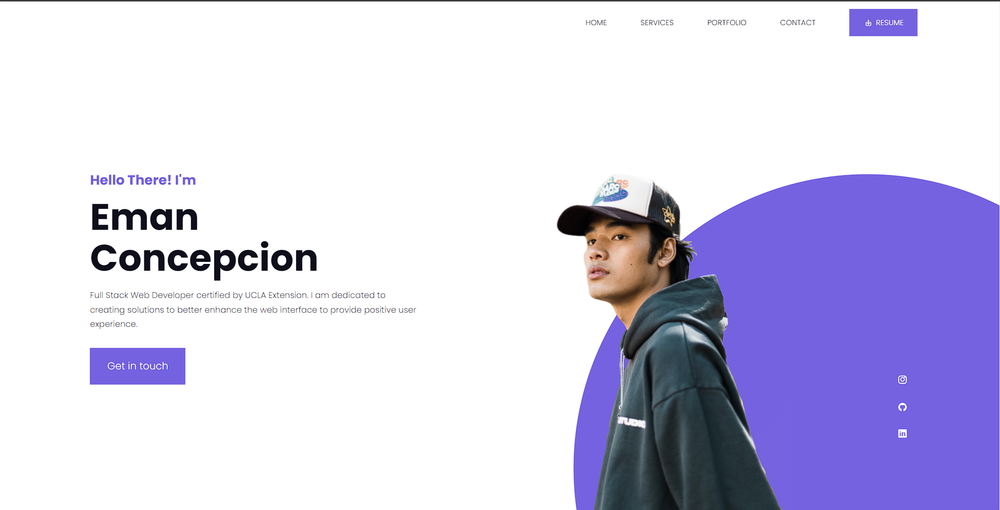
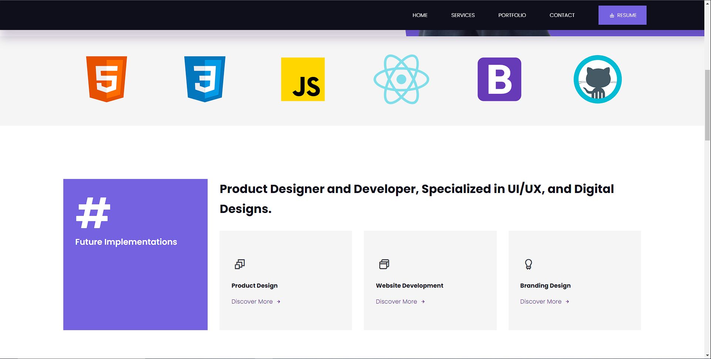
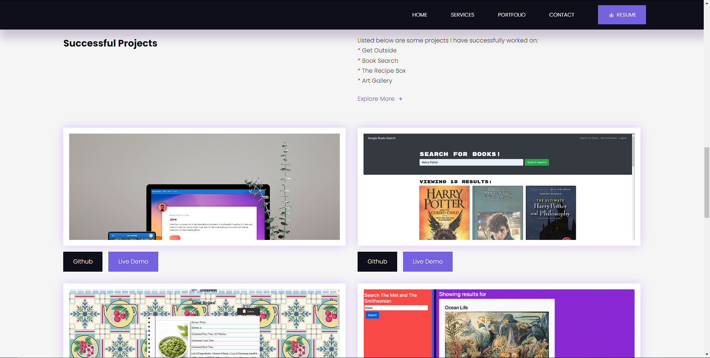
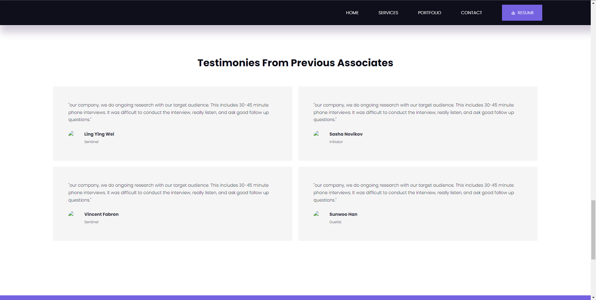
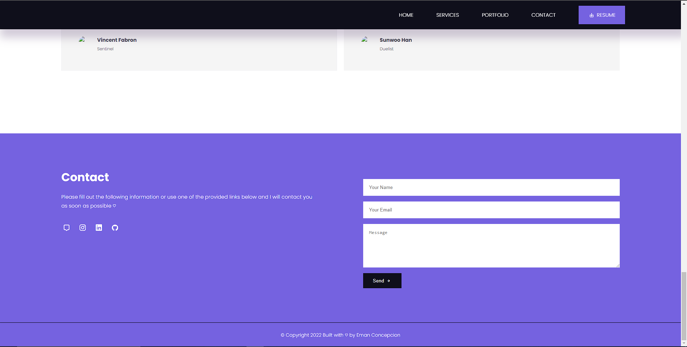

# Portfolio

## Description

I have created a portfolio that displays information about me, my most recent projects, skills, and how to get in contract with me

## Table of Contents

- [Description](#description)
- [Technologies](#technologies)
- [Installation](#installation)
- [Links](#links)
- [Screenshots](#screenshots)

## Technologies

- 
- 
- 

## Installation

This is a webpage and it does not require any installation. To visit the website click on the website that is provided below.

## Links

- [GitHub](https://github.com/Emanconcepcion/personal-porfolio)
- [Website](https://emanconcepcion.github.io/personal-porfolio/)

## Screenshots

